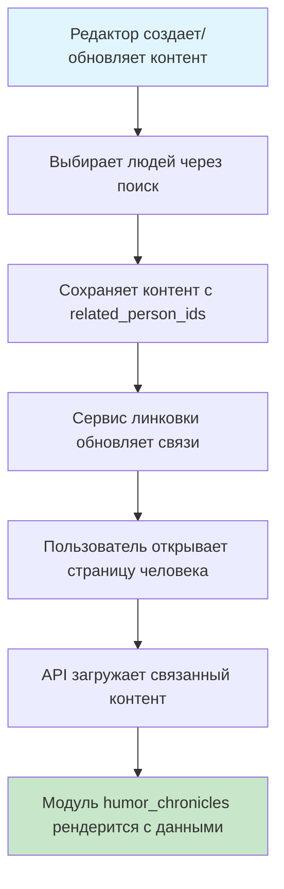

# План: Система автоматической линковки контента к людям

## Архитектура решения

Система будет работать следующим образом:

1. **Хранение связей**: В сущностях News, Article, Show хранятся `related_person_ids` (ID людей, связанных с контентом)
2. **Модуль "Юмористические хроники"**: Новый тип модуля `humor_chronicles`, который динамически заполняется при загрузке страницы человека
3. **Автоматическое обновление**: При создании/обновлении контента автоматически обновляются связи на страницах людей
4. **Помощь редактору**: Компонент поиска людей по имени для выбора и добавления связей

## Диаграмма потока данных

## Этапы реализации

### 1. Обновление моделей данных

**Файлы:**

- `backend/models/content.py`
- `backend/models/modules.py`

**Изменения:**

- Добавить поле `related_person_ids` в модель `Show` (если отсутствует)
- Добавить новый тип модуля `HUMOR_CHRONICLES = "humor_chronicles"` в `ModuleType`
- Создать схему данных `HumorChroniclesData` для модуля (может быть пустой, т.к. данные динамические)

### 2. Создание сервиса автоматической линковки

**Новый файл:** `backend/services/linking.py`

**Функционал:**

- `update_person_links(content_type, content_id, person_ids)` - обновляет связи при создании/обновлении контента
- `get_linked_content(person_id, content_types, limit)` - получает связанный контент для человека
- `ensure_chronicles_module(person_id)` - создает/обновляет модуль "Юмористические хроники" на странице человека

**Алгоритм обновления связей:**

1. При сохранении контента (News/Article/Show) извлекаем `related_person_ids`
2. Для каждого `person_id`:

   - Проверяем наличие модуля `humor_chronicles` на странице человека
   - Если модуля нет - создаем его
   - Обновляем список связанного контента (можно кешировать или вычислять динамически)

### 3. API endpoints для линковки

**Файл:** `backend/routes/content.py`

**Новые endpoints:**

- `GET /api/people/search?q={name}` - поиск людей по имени для помощи редактору
- `GET /api/people/{id}/linked-content?types=news,article,show` - получение связанного контента (для динамического заполнения модуля)

**Изменения в существующих endpoints:**

- В `create_article`, `update_article`, `create_news`, `update_news`, `create_show`, `update_show` добавить вызов сервиса линковки после сохранения

### 4. Обновление Create/Update моделей

**Файл:** `backend/models/content.py`

**Изменения:**

- Добавить `related_person_ids: Optional[List[str]] `в `ShowCreate` и `ShowUpdate`
- Убедиться, что `ArticleCreate`, `ArticleUpdate`, `NewsCreate`, `NewsUpdate` поддерживают `related_person_ids`

### 5. Frontend: Компонент поиска людей

**Новый файл:** `frontend/src/admin/components/PersonSelector.jsx`

**Функционал:**

- Поле ввода с автодополнением
- Поиск людей по имени через API
- Выбор нескольких людей
- Отображение выбранных людей с возможностью удаления

### 6. Frontend: Интеграция в редакторы

**Файлы:**

- `frontend/src/admin/pages/ArticleEditPage.jsx`
- `frontend/src/admin/pages/NewsEditPage.jsx`
- `frontend/src/admin/pages/ShowEditPage.jsx`

**Изменения:**

- Добавить компонент `PersonSelector` в формы редактирования
- Сохранять выбранные `related_person_ids` при отправке формы

### 7. Frontend: Рендеринг модуля "Юмористические хроники"

**Файл:** `frontend/src/public/components/ModuleRenderer.jsx`

**Изменения:**

- Добавить обработку типа `humor_chronicles`
- При рендеринге модуля:
  - Если данные пустые или отсутствуют - запросить через API `/api/people/{id}/linked-content`
  - Отобразить список связанного контента (новости, статьи, шоу) с группировкой по типам
  - Сортировка по дате публикации (новые сверху)

**Структура отображения:**

- Заголовок: "Юмористические хроники"
- Группы: "Новости", "Статьи", "Шоу"
- Каждая группа - список карточек с превью, заголовком, датой, ссылкой

### 8. Backend: Динамическое заполнение модуля

**Файл:** `backend/routes/content.py`

**Endpoint:** `GET /api/people/{id_or_slug}`

**Изменения:**

- При загрузке страницы человека проверять наличие модуля `humor_chronicles`
- Если модуль есть, но данные пустые - заполнять динамически через сервис линковки
- Возвращать заполненный модуль в ответе

**Альтернативный подход (рекомендуемый):**

- Модуль хранится с минимальными данными (только метаданные)
- Фронтенд запрашивает связанный контент отдельным запросом при рендеринге модуля
- Это позволяет кешировать страницу человека независимо от обновлений контента

## Алгоритм работы системы

### При создании/обновлении контента:

1. Редактор выбирает людей через `PersonSelector`
2. Сохраняются `related_person_ids` в документе контента
3. Вызывается `linking_service.update_person_links()`
4. Для каждого человека обновляется/создается модуль `humor_chronicles` (опционально - можно вычислять динамически)

### При загрузке страницы человека:

1. Загружается документ человека с модулями
2. Если есть модуль `humor_chronicles`:

   - Фронтенд запрашивает `/api/people/{id}/linked-content`
   - API возвращает связанный контент (news, articles, shows)
   - Модуль рендерится с полученными данными

## Оптимизация производительности

1. **Индексы MongoDB:**

   - Создать индекс на `related_person_ids` в коллекциях `news`, `articles`, `shows`
   - Индекс на `content_type` и `status` для быстрого поиска опубликованного контента

2. **Кеширование:**

   - Кешировать результаты поиска связанного контента (TTL: 5-10 минут)
   - Использовать Redis для кеша (если доступен)

3. **Пагинация:**

   - Ограничить количество элементов в модуле (например, последние 20)
   - Добавить "Показать все" с переходом на страницу со всеми связанными материалами

## Миграция существующих данных

**Рекомендуемый порядок действий:**

1. **Сначала реализовать модуль и систему линковки** (этапы 1-8)
2. **Создать утилиту для автоматического создания связей из тегов**
3. **Интегрировать в процесс импорта**
4. **Импортировать данные с автоматическим созданием связей**

**Детали реализации:**

**Файл:** `migration/link_persons_from_tags.py`

**Функционал:**

- `extract_person_links_from_tags(content_doc, people_collection)` - извлекает связи из тегов
- Поиск людей по точному совпадению имени в тегах
- Обработка неоднозначностей (несколько людей с одним именем - логировать для ручной проверки)
- Возвращает список `person_ids` для добавления в `related_person_ids`

**Интеграция в импорт:**

- В скриптах импорта (`import_people_from_sql.py`, `import_shows.py` и т.д.) вызывать функцию после создания документа
- Автоматически добавлять найденные `person_ids` в `related_person_ids`
- Логировать случаи, когда человек не найден по тегу (для последующей ручной обработки)

**Преимущества этого подхода:**

- Связи создаются автоматически при импорте
- Можно сразу тестировать модуль на реальных данных
- Не нужно обрабатывать тысячи записей вручную после импорта
- Модуль будет работать сразу после импорта